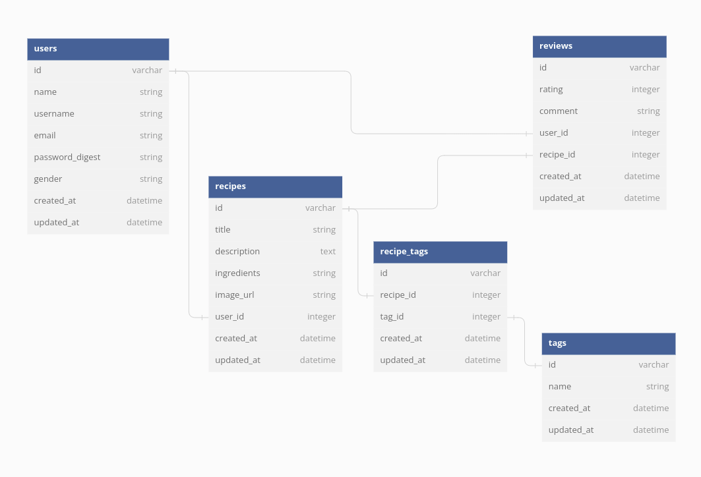

# FOODIE WOOGIE
==========================

## Description
**Foodie Woogie** is a mini web application that allows users to browse, create, update and delete recipes from a food library.

## REQUIREMENTS
### Prerequisites
### Get Started
To get started you need to do the following:
* Clone the Repository using: 
```
 https://github.com/jamnjeri/superheroes
```
* Install necessary gems using:
```
bundle install
```

## PROJECT DELIVERABLES
### Relationships
For this code challenge, we worked on an API for tracking users, recipes, tags and their reviews. We had 4 models: Users, Recipes, Reviews and RecipeTag.
* A User has many recipes
* A User has many reviews
* A Recipe belongs to a user
* A Recipe has many reviews
* A Recipe has many recipeTags
* A Recipe has many Tags through RecipeTags.
* A Review belongs to a user
* A Review belongs to a recipe
* A Tag has many recipeTags
* A Tag has many recipes through RecipeTags.
* A RecipeTag belongs to a recipe.
* A RecipeTag belongs to a tag.



### Routes

## Languages Used
* Rails
## Author

## Status
    maintained, and is currently in development
## Version
    v0.1.0
## Usage
## License